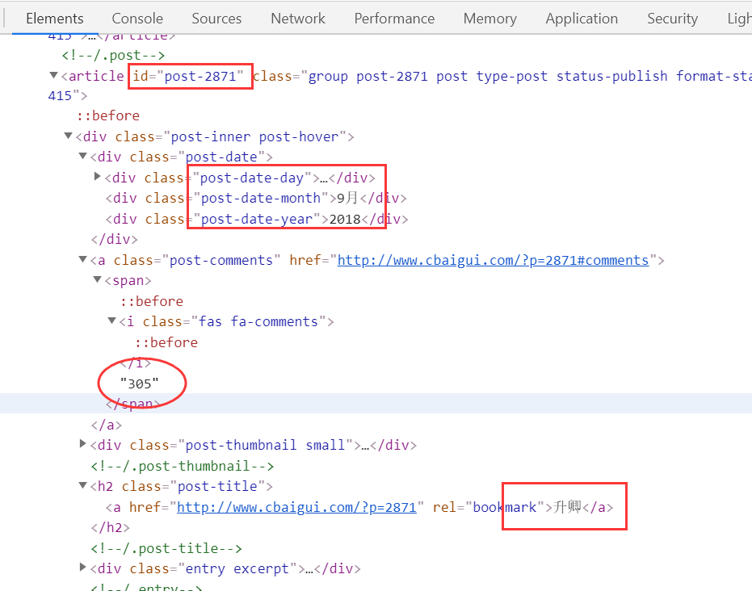

# 爬虫学习--知妖网站数据爬取

Python爬虫在笔者学习Python时接触过并且也使用过（见 [豆瓣数据爬取作业](https://github.com/Freator/Homework_DoubanSpider)），但是并没有比较系统的学习，现在算是从最简单的网站爬取开始学习。**前路漫漫，当积跬步，先行百里，再至千里**。

## 爬取网站介绍

[知妖（中国妖怪百集）](http://www.cbaigui.com/)，是一个开放的在线“妖怪”资料库，致力于收集、整理、介绍、分享古人文献中的“妖怪”，算是个私人非营利性的网站。网站上的内容分享都是自由开放的，无需注册或付费，鉴于里面的图片数据，在[关于授权](http://www.cbaigui.com/?page_id=4635)中有说明，是需要授权才能下载使用的，所以本次爬取的数据只包括**文本数据**。网站的网页源码就是简单的HTML，在初学爬虫的时候，笔者以为爬取此类网站是比较容易入手的。

## 网站数据分析

首先，我们进入到知妖网站的主页，可以看到，主页上主要分为`首页`、`目录`、`杂谈`、`夜谭`、`关于`等5个板块，在主页（即首页）上，各种妖怪们按顺序排列，每页大概20来个，目前一共85页。

当然可以按照这个页数来爬取每一个妖怪的数据，但是本次我们是分目录爬取的，即先进入`目录`页面。

可以看到各个按照字母索引的书名目录。每一个书名点进去就是这个书名下包含的妖怪们，如 `白泽图` ，点进去是这样的

在这个页面上，我们可以看到这个书名目录下包含的每一个妖怪的一些基本数据，本次所需要爬取的数据如标注所示

其中`[1][2][3]`部分是我们需要爬取的数据，分别表示该妖怪发表的日期，该妖怪的名字和该妖怪的评论数量。（其他数据也可以按照自己的需求进行爬取）

然后点进一个妖怪，进入到这个妖怪的介绍页面，如 `升卿` ，点进去之后，可以看到它的介绍，包括`发表日期`（所以日期数据在这里也可以获取），图片（部分有部分没有）、出处及原文描述，下面还有`获赞数量`，该妖怪所属的`Tags`，以及具体的评论文字（评论没有分页展示，需要爬取的话也比较方便）

## 爬取简单流程

1. 直接进入到目录页面下，先获取目录中的所有书名目录（网页源码中包含每一个目录的ID，一并获取）
2. 进入到每一个目录下，获取所有该目录下所有的妖怪，包括该妖怪发表日期，妖怪名称，评论数量（网页源码中还包含妖怪ID，可以一并获取）
3. 进入到该目录下每一个妖怪的介绍页面，获取点赞数、Tags两个字段（其他数据可以根据自己的需要爬取）
4. 循环第`2` 和第`3`步，直到所有的书名目录和该目录下的妖怪全部被爬取
5. 得到的每一个妖怪数据应该包括：`妖怪ID`，`妖怪名称`，`书名目录ID`，`书名目录名称`，`发表日期`，`Tags`，`评论数量`，`点赞数量`。保存到文件中。  

## 网页源码分析

### 目录页面

打开开发者模式(`Chrome`和`Firefox`都可以直接按`F12`打开)，刷新当前页面，可以看到该网页是以`GET`方式请求得到的，并且是一个简单的`HTML`页面

然后我们转到`Elements`中，看到我们需要爬取的内容，通过标签一级一级找下来，都在`class="entry themeform"`的`div`标签中，如下图所示

然后，我们再打开比如`B`类下的`table`标签，可以看到里面的内容，就是包含这个内容索引下的所有书名目录，这些是我们需要爬取并保存的内容

这里我们需要爬取每一个书名目录所属的字母索引，每个书名目录的名称和对应的`URL`备用，可以从图中看到每一个书名目录是包含在`strong`标签下的，所以就找到这个标签下的所有`a`标签，保存该标签的`href`属性和标签内容就行（当然也有其他方式方法可以找这些数据）

### 书名目录页面

还是以`白泽图`为例，同样可以看到是以`GET`请求获取的`HTML`内容。

转到`Elements`下，可以找到需要获取的内容。从图中可以看出，每一个妖怪的数据都在一个`article`标签内。

打开其中一个`article`标签，可以看到里面包括我们要获取的日期数据，妖怪姓名，评论数量，以及妖怪的`ID`等。

### 妖怪介绍页面

同样以`升卿`为例，进入到该妖怪的介绍页面，依然是以`GET`方式请求的`HTML`网页。在`Element`中，找到所需要的标签内容，如下图所示。

## 爬取程序

（To be continued）

@Date : 2020/5/17（Update : 2020/5/23）

@Author : [Freator Tang](https://github.com/Freator)

@Email : [bingcongtang@gmail.com](mailto:bingcongtang@gmail.com)
